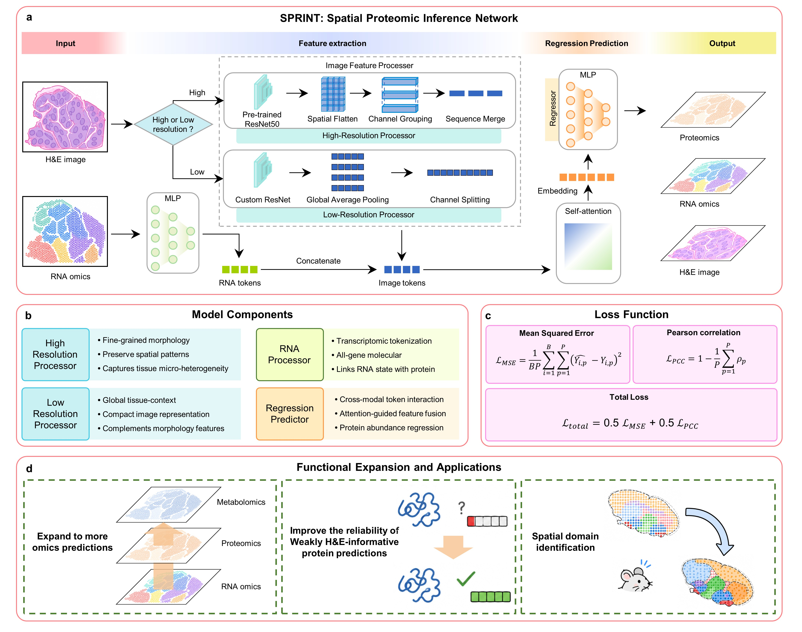

# SPRINT

### Multimodal reconstruction of spatial molecular profiles from histology and transcriptomics

[](https://www.python.org/)
[](https://pytorch.org/)
[](LICENSE)
[](https://doi.org/10.5281/zenodo.XXXXXXX)

SPRINT (**S**patial **Pr**oteomic **I**nference **N**e**t**work) is a supervised multimodal framework for reconstructing spatially resolved molecular profiles from tissue images and spatial transcriptomic measurements. SPRINT combines resolution-adaptive image encoders with token-level self-attention to fuse morphological and transcriptional information.

The framework supports:

- spatial protein reconstruction from paired histology and transcriptomics;
- high- and low-resolution images through dedicated image-processing branches;
- independent-section, spatially disjoint and cross-species evaluation;
- spatial metabolite reconstruction when trained with metabolomic targets; and
- export of spot-level predictions for downstream spatial analysis.

<p align="center">
  
</p>

> **Data availability**
>
> Large datasets and pretrained weights are not hosted in this GitHub repository. They will be distributed through Zenodo. See [`datas/README.md`](datas/README.md) for download instructions and the required directory layout.

---

## Repository layout

```text
.
├── codes/
│   ├── sprint/                         # Shared SPRINT implementation
│   │   ├── models.py                   # Model architectures
│   │   ├── data.py                     # Dataset classes and preprocessing
│   │   ├── training.py                 # Training and evaluation utilities
│   │   ├── inference.py                # General inference functions
│   │   ├── prediction_export.py        # Prediction and CSV export
│   │   └── utils.py                    # Reproducibility and device utilities
│   └── _legacy_models/                 # Exact architectures for released checkpoints
├── datas/                              # Download separately from Zenodo
│   ├── brain/
│   ├── breast/
│   ├── msi/
│   ├── spleen/
│   ├── tonsil/
│   ├── models/                         # Pretrained checkpoints
│   └── outputs/                        # Generated prediction tables
├── model_*.ipynb            # Training and evaluation workflows
├── produce_*_predictions.ipynb         # Prediction-production workflows
├── requirements.txt
└── setup.py
```


---

## Installation

```bash
git clone https://github.com/<OWNER>/<REPOSITORY>.git
cd <REPOSITORY>

python -m venv .venv
```

Activate the environment:

```bash
# Linux or macOS
source .venv/bin/activate

# Windows PowerShell
.\.venv\Scripts\Activate.ps1
```

Install SPRINT and the notebook environment:

```bash
python -m pip install --upgrade pip
python -m pip install -e .
python -m pip install jupyterlab
jupyter lab
```

GPU acceleration is recommended for training and high-resolution inference. Prediction notebooks use CUDA when available and otherwise fall back to CPU execution.

---

## Data and pretrained checkpoints

Download the SPRINT archive from:

> **Zenodo:** [SPRINT datasets and pretrained models](https://doi.org/10.5281/zenodo.XXXXXXX)  
> The DOI is a placeholder and will be updated after the archive is published.

Extract the archive directly into `datas/`:

```text
datas/
├── brain/
├── breast/
├── msi/
├── spleen/
├── tonsil/
├── models/
└── outputs/
```

Do not rename the downloaded files or checkpoint directories unless the corresponding notebook paths are also updated. The full expected layout is documented in [`datas/README.md`](datas/README.md).

---

## Reproducing the experiments

Every experiment has two complementary entry points:

1. a **training notebook** that prepares the data, trains SPRINT and evaluates the model; and
2. a **prediction notebook** that loads a released checkpoint and exports predictions and measured targets.

| Experiment | Training and evaluation | Prediction production | Evaluation design |
|---|---|---|---|
| Human brain | [`model_brain_refactored.ipynb`](model_brain.ipynb) | [`produce_brain_predictions.ipynb`](produce_brain_predictions.ipynb) | Spatially non-overlapping diagonal split |
| Human-to-mouse breast | [`model_breast_refactored.ipynb`](model_breast.ipynb) | [`produce_breast_predictions.ipynb`](produce_breast_predictions.ipynb) | Cross-species and cross-resolution transfer |
| Mouse brain metabolomics | [`model_mouse_brain_refactored.ipynb`](model_mouse_brain.ipynb) | [`produce_msi_predictions.ipynb`](produce_msi_predictions.ipynb) | Independent-section metabolite reconstruction |
| Mouse spleen | [`model_spleen_refactored.ipynb`](model_spleen.ipynb) | [`produce_spleen_predictions.ipynb`](produce_spleen_predictions.ipynb) | Independent-section, low-resolution reconstruction |
| Human tonsil | [`model_tonsil_refactored.ipynb`](model_tonsil.ipynb) | [`produce_tonsil_predictions.ipynb`](produce_tonsil_predictions.ipynb) | Independent-section, high-resolution reconstruction |

Run all notebooks from the repository root so that relative paths such as `datas/tonsil/...` resolve consistently.

---

## Guided example: human tonsil

The tonsil experiment illustrates the complete workflow, from multimodal training to prediction export.

### 1. Prepare the data

After extracting the Zenodo archive, verify that these files are present:

```text
datas/
├── tonsil/
│   ├── Tonsil_1_Final.h5ad
│   └── Tonsil_2_Final.h5ad
└── models/
    └── tonsil/
        ├── A2/best_model.pth
        ├── HE_Only/best_model.pth
        └── RNA_Only/best_model.pth
```

`Tonsil_1_Final.h5ad` is used for training and `Tonsil_2_Final.h5ad` is the held-out evaluation section. Evaluation is restricted to proteins shared by the two antibody panels.

### 2. Train SPRINT

Open [`model_tonsil_refactored.ipynb`](model_tonsil.ipynb) and run the cells in order. The notebook:

1. loads the paired image, transcriptomic and protein measurements;
2. identifies proteins shared between the training and evaluation sections;
3. selects the image-processing scheme from the image resolution;
4. constructs the multimodal dataloaders;
5. trains the complete SPRINT model; and
6. optionally trains the H&E-only and RNA-only ablations.

High-resolution tonsil images use the Scheme A processor. The image branch can be selected automatically or specified manually in the notebook configuration.

### 3. Produce prediction tables

Open [`produce_tonsil_predictions.ipynb`](produce_tonsil_predictions.ipynb) and run all cells. The notebook loads the released complete and ablation checkpoints, performs inference on the held-out section and creates:

```text
datas/outputs/tonsil/
├── tonsil_A2_predictions.csv
├── tonsil_A2_targets.csv
├── tonsil_HE_Only_predictions.csv
├── tonsil_HE_Only_targets.csv
├── tonsil_RNA_Only_predictions.csv
└── tonsil_RNA_Only_targets.csv
```

Each prediction table contains one row per spatial spot and one column per reconstructed protein. Its paired target table contains measured protein abundances in the same spot and protein order.

### 4. Adapt the workflow

To apply the workflow to another compatible dataset:

1. prepare an `.h5ad` file using the schema below;
2. update the dataset paths in the training notebook;
3. define the target molecular features;
4. select or automatically detect the image-resolution branch; and
5. update `MODEL_SPECS` in the production notebook with the checkpoint directories to export.

Production notebooks validate required paths before inference and create their output directories automatically.

---

## Expected AnnData schema

| AnnData field | Description |
|---|---|
| `.X` | Spot-by-gene expression matrix |
| `.var_names` | Gene identifiers in model input order |
| `.obsm["spatial_img_crops"]` | Image patches aligned to spatial spots |
| `.obsm["protein_expression_log"]` | Normalized spatial protein abundance |
| `.obsm["metabolite_expression_log"]` | Normalized metabolite abundance for the MSI experiment |
| `.obsm["spatial"]` | Two-dimensional spot coordinates |
| `.uns["protein_names"]` | Protein names matching the protein matrix columns |
| `.uns["metabolite_names"]` | Metabolite names matching the metabolite matrix columns |

Input normalization and image-shape handling are implemented in [`codes/sprint/data.py`](codes/sprint/data.py).


---

## Citation

The citation will be updated when the final article metadata becomes available.

## License

SPRINT is released under the [MIT License](LICENSE).

## Contact

For questions, bug reports or feature requests, please open a GitHub issue.
